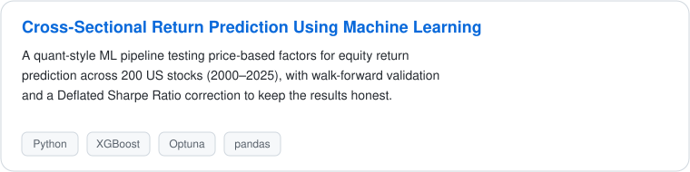
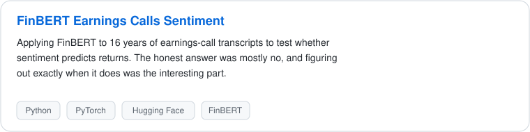
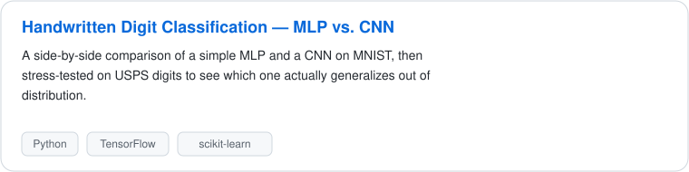

<h1 align="center">Hey there 👋, I'm Pedro</h1>

  
  

---

I'm an MSc Data Science student who likes turning data into decisions. Most of my time goes into experimenting with machine learning and forecasting, applying it wherever it's useful, from equity markets to financial text to computer vision, rather than sticking to one domain.

---

### Recent projects

  

  

  

---

### Tools I use

  
  
  
  
  
  
  

---

### GitHub contributions

  

